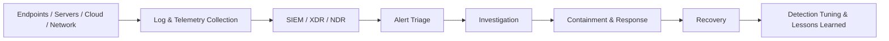
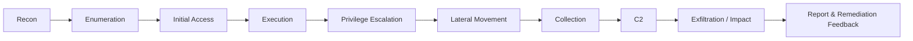
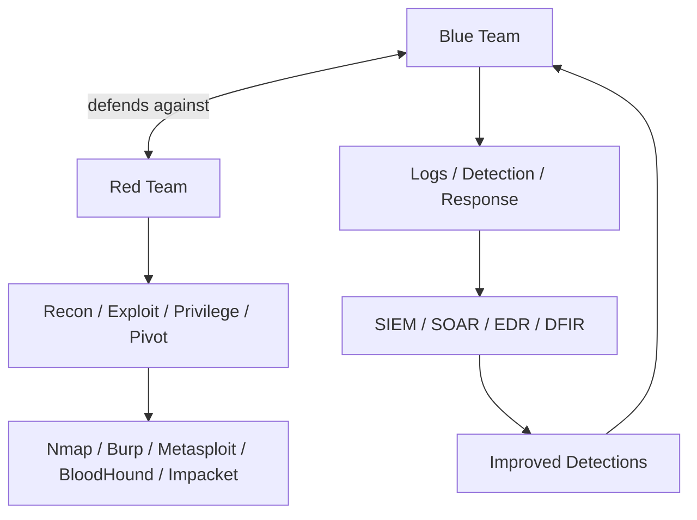

# Blue Team vs Red Team Research Analysis

**Purpose:** A reusable, GitHub-ready reference for early cybersecurity learners.  
**Scope:** Core concepts, tools, ecosystem structure, roles, and starter recommendations for blue team and red team study.

---

## Method

This analysis is built around authoritative framework sources and official tool documentation, especially:
- NIST Cybersecurity Framework (CSF) 2.0
- NIST glossary entries and incident-response terminology
- MITRE ATT&CK Enterprise matrix and tactics
- Official vendor/tool documentation for the tools listed below

---

# Section A — Blue Team

## A1. 30 most important blue team definitions / terms / core concepts

| # | Term | Practical meaning |
|---|---|---|
| 1 | SOC (Security Operations Center) | The team/function that monitors, investigates, and responds to security activity. |
| 2 | Telemetry | Raw security data collected from endpoints, networks, cloud, and apps. |
| 3 | Log | A record of an event generated by a system, app, or device. |
| 4 | Alert | A signal that a rule, model, or tool has detected something suspicious. |
| 5 | Event | Any notable occurrence in a system or network. |
| 6 | Incident | A cybersecurity event that affects the organization and requires response and recovery. |
| 7 | Triage | The first-pass sorting and prioritization of alerts/incidents. |
| 8 | False positive | A harmless activity incorrectly flagged as malicious. |
| 9 | False negative | A malicious activity that is missed by detection. |
| 10 | IOC (Indicator of Compromise) | A clue that a system may already be compromised. |
| 11 | IOB (Indicator of Behavior) | Behavior pattern that suggests malicious activity, even if no single IOC exists. |
| 12 | TTPs | Tactics, techniques, and procedures used by an adversary. |
| 13 | Detection engineering | Designing reliable detections from logs, telemetry, and ATT&CK mapping. |
| 14 | Threat hunting | Proactive searching for hidden attacker activity. |
| 15 | Baseline | The normal “known good” state used for comparison. |
| 16 | Anomaly | Activity that deviates from expected behavior. |
| 17 | Correlation | Connecting multiple events into one meaningful security story. |
| 18 | SIEM | Security Information and Event Management; centralizes and analyzes security data. |
| 19 | SOAR | Security Orchestration, Automation, and Response; automates repeatable response steps. |
| 20 | EDR | Endpoint Detection and Response; endpoint visibility plus detection and response actions. |
| 21 | XDR | Extended Detection and Response; correlates across multiple layers such as endpoint, network, cloud. |
| 22 | NDR | Network Detection and Response; detection focused on network traffic and flow. |
| 23 | Case management | Tracking investigation work, evidence, and analyst actions. |
| 24 | Runbook | Step-by-step procedure for handling a known security scenario. |
| 25 | Playbook | A broader response workflow, often used by a SOC or SOAR platform. |
| 26 | IR (Incident Response) | The process of handling violations of security policy and reducing impact. |
| 27 | DFIR | Digital Forensics and Incident Response; evidence collection plus incident handling. |
| 28 | Threat intelligence | Structured knowledge about adversaries, infrastructure, and campaigns. |
| 29 | YARA rule | Pattern-based rule for identifying suspicious files or malware families. |
| 30 | Zero Trust | Security approach that does not automatically trust any user, device, or network. |

## A2. 15 most important blue team tools

| # | Tool | Best use | Start first? | Link |
|---|---|---|---|---|
| 1 | **Wireshark** | Packet analysis and protocol inspection | **YES** | https://www.wireshark.org/ |
| 2 | **Sysinternals Suite** | Windows troubleshooting, process, autorun, and system inspection | **YES** | https://learn.microsoft.com/sysinternals/ |
| 3 | **Wazuh** | Open-source XDR / SIEM / endpoint monitoring | **YES** | https://wazuh.com/ |
| 4 | **Zeek** | Network security monitoring and rich log generation | **YES** | https://zeek.org/ |
| 5 | **Suricata** | Network IDS/IPS and signature-based detection | **YES** | https://suricata.io/ |
| 6 | **osquery** | Endpoint visibility using SQL-like queries | **YES** | https://osquery.io/ |
| 7 | **Velociraptor** | DFIR, endpoint collection, hunting, and evidence gathering | **YES** | https://docs.velociraptor.app/ |
| 8 | **Elastic Security** | SIEM + endpoint + security analytics platform | Maybe later | https://www.elastic.co/security |
| 9 | **Splunk** | Large-scale log analysis and SIEM | Maybe later | https://www.splunk.com/ |
| 10 | **TheHive** | SOC case management and incident response workflows | Maybe later | https://thehive-project.org/ |
| 11 | **MISP** | Threat intelligence sharing and management | Maybe later | https://www.misp-project.org/ |
| 12 | **Sigma** | Generic detection rule format for SIEMs | Maybe later | https://sigmahq.io/ |
| 13 | **YARA** | File and malware pattern matching | Maybe later | https://virustotal.github.io/yara/ |
| 14 | **Security Onion** | Blue-team Linux distribution for monitoring and analysis | Maybe later | https://securityonion.net/ |
| 15 | **Microsoft Sentinel** | Cloud-native SIEM/SOAR in Azure ecosystems | Maybe later | https://learn.microsoft.com/azure/sentinel/ |

### Blue-team starter stack
Start with:
- Wireshark
- Sysinternals Suite
- Wazuh
- Zeek
- Suricata
- osquery

These give the fastest path into packet analysis, host inspection, alerting, and network monitoring.

## A3. Blue team ecosystem, structure, roles, tools used by certain roles

### Ecosystem summary
Blue team work usually follows the NIST CSF logic:
- **Govern / Identify / Protect** for preparation
- **Detect / Respond / Recover** for operational defense

### Common roles and typical tools

| Role | Main responsibilities | Typical tools |
|---|---|---|
| SOC L1 Analyst | Monitor alerts, triage, validate obvious noise | SIEM, EDR, Wazuh, ticketing tools |
| SOC L2 Analyst | Deep investigation, correlation, escalation | SIEM, Zeek, Suricata, Wireshark, TheHive |
| Incident Responder | Contain, eradicate, recover, coordinate actions | SOAR, EDR, Velociraptor, MISP, TheHive |
| Threat Hunter | Search for stealthy attacker activity | SIEM, EDR, Sigma, ATT&CK Navigator |
| Detection Engineer | Build and tune detections | Sigma, YARA, SIEM, ATT&CK mapping |
| DFIR Analyst | Collect evidence, analyze hosts, preserve artifacts | Velociraptor, osquery, Sysinternals, YARA |
| Network Defender | Protect and monitor network traffic | Zeek, Suricata, Wireshark |
| Vulnerability Manager | Track exposed weaknesses and patch priorities | Vulnerability scanners, SIEM, asset inventory |
| CTI Analyst | Curate adversary intelligence and IOCs | MISP, ATT&CK, case management platforms |
| Security Engineer | Deploy and maintain monitoring stack | SIEM, EDR, logging pipelines, cloud security tools |

### Blue-team flow

### Blue-team maturity path
1. Learn logs, network traffic, and endpoint basics.
2. Add SIEM thinking and alert triage.
3. Add incident response and detection engineering.
4. Add threat hunting, DFIR, and automation.

---

# Section B — Red Team

## B1. 30 most important red team definitions / terms / core concepts

| # | Term | Practical meaning |
|---|---|---|
| 1 | Reconnaissance | Gathering information about a target before active testing. |
| 2 | Enumeration | Actively listing users, services, shares, paths, or app details. |
| 3 | Initial access | The first foothold into a target environment. |
| 4 | Execution | Running code or commands on a target. |
| 5 | Persistence | Maintaining access after reboot or cleanup. |
| 6 | Privilege escalation | Gaining higher permissions than originally obtained. |
| 7 | Defense evasion | Avoiding detection by security controls. |
| 8 | Credential access | Obtaining passwords, hashes, tokens, or session material. |
| 9 | Discovery | Learning about systems, trust, network, or data after entry. |
| 10 | Lateral movement | Moving from one system to another. |
| 11 | Pivoting | Using one compromised host as a path to another target. |
| 12 | Collection | Gathering files, credentials, or sensitive data. |
| 13 | Command and control (C2) | Remote channel used to control compromised systems. |
| 14 | Exfiltration | Removing data from a target environment. |
| 15 | Impact | Actions that disrupt, encrypt, destroy, or modify data/systems. |
| 16 | Payload | The code delivered to perform an action. |
| 17 | Exploit | Code or method that abuses a vulnerability. |
| 18 | Vulnerability | A weakness that can be abused by an attacker. |
| 19 | Attack surface | The total set of ways a system can be attacked. |
| 20 | Foothold | A stable presence in a target environment. |
| 21 | OPSEC | Operational security practices used to avoid exposure. |
| 22 | Living off the land | Using legitimate tools already present on the target. |
| 23 | Phishing | Tricking a user into revealing access or running malicious content. |
| 24 | Spear phishing | Targeted phishing aimed at a specific person or group. |
| 25 | Password spraying | Trying a few common passwords against many accounts. |
| 26 | Brute force | Repeated password guessing over many combinations. |
| 27 | Fuzzing | Sending varied inputs to discover bugs or crashes. |
| 28 | Web shell | Script-based remote access through a vulnerable web app. |
| 29 | Sandbox evasion | Avoiding analysis environments during malicious execution. |
| 30 | Explot chain | Multiple linked weaknesses used to reach an objective. |

## B2. 15 most important red team tools

| # | Tool | Best use | Start first? | Link |
|---|---|---|---|---|
| 1 | **Nmap** | Network discovery and security scanning | **YES** | https://nmap.org/ |
| 2 | **Burp Suite Community** | Web app testing and proxying | **YES** | https://portswigger.net/burp |
| 3 | **Gobuster** | Directory, DNS, and vhost brute forcing | **YES** | https://github.com/OJ/gobuster |
| 4 | **Metasploit Framework** | Modular exploit and assessment framework | **YES** | https://www.metasploit.com/ |
| 5 | **sqlmap** | Automated SQL injection testing | **YES** | https://sqlmap.org/ |
| 6 | **Hydra** | Online login and password attack testing | **YES** | https://www.kali.org/tools/hydra/ |
| 7 | **ffuf** | Fast web content and parameter fuzzing | **YES** | https://github.com/ffuf/ffuf |
| 8 | **Wireshark** | Traffic inspection during testing | **YES** | https://www.wireshark.org/ |
| 9 | **Impacket** | Network protocol manipulation and AD-related testing | Maybe later | https://github.com/fortra/impacket |
| 10 | **BloodHound** | Active Directory attack-path analysis | Maybe later | https://bloodhound.specterops.io/ |
| 11 | **NetExec** | Network protocol automation and validation in internal testing | Maybe later | https://www.netexec.wiki/ |
| 12 | **Hashcat** | Password cracking and hash analysis | Maybe later | https://hashcat.net/hashcat/ |
| 13 | **John the Ripper** | Password cracking and hash testing | Maybe later | https://www.openwall.com/john/ |
| 14 | **Responder** | LLMNR/NBT-NS poisoning style lab testing | Maybe later | https://github.com/lgandx/Responder |
| 15 | **Kali Linux** | Offensive testing environment and tool collection | Maybe later | https://www.kali.org/ |

### Red-team starter stack
Start with:
- Nmap
- Burp Suite Community
- Gobuster
- Metasploit Framework
- sqlmap
- Hydra
- ffuf
- Wireshark

These tools give the fastest path into recon, web testing, enumeration, and basic exploitation workflow.

## B3. Red team ecosystem, structure, roles, tools used by certain roles

### Ecosystem summary
Red-team workflows typically follow a chain similar to MITRE ATT&CK:
- Reconnaissance
- Resource development
- Initial access
- Execution
- Persistence
- Privilege escalation
- Defense evasion
- Credential access
- Discovery
- Lateral movement
- Collection
- C2
- Exfiltration
- Impact

### Common roles and typical tools

| Role | Main responsibilities | Typical tools |
|---|---|---|
| Recon Operator | External footprinting and enumeration | Nmap, Gobuster, ffuf |
| Web Tester | Web app testing and injection discovery | Burp Suite, sqlmap |
| Initial Access Operator | Find and abuse the first entry point | Nmap, Burp, Metasploit, Hydra |
| Exploitation Specialist | Weaponize vulnerabilities and payloads | Metasploit, custom scripts, Impacket |
| AD Operator | Attack Windows domains and trust paths | BloodHound, Impacket, NetExec |
| Post-Exploitation Operator | Maintain access, pivot, collect data | Impacket, NetExec, shell tooling |
| Payload/Implant Developer | Build or modify implants and payloads | Python, Go, C/C++, OPSEC tooling |
| Password Attacker | Test password strength and reuse | Hydra, Hashcat, John the Ripper |
| Reporting Lead | Translate findings into business language | Markdown, screenshots, evidence tools |
| Adversary Emulation Lead | Map activity to ATT&CK for realistic exercises | ATT&CK Navigator, planning notes |

### Red-team flow

### Red-team maturity path
1. Learn recon and enumeration.
2. Learn web testing and basic exploitation.
3. Learn AD testing and lateral movement.
4. Learn OPSEC, payload modification, and reporting.

---

# Cross-team concept map

---

# Suggested study order for an early cybersecurity learner

## Blue team first
1. Wireshark
2. Sysinternals Suite
3. Windows event logs and Linux logs
4. Wazuh
5. Zeek
6. Suricata
7. SIEM basics
8. Incident response workflow
9. Sigma and YARA
10. Threat hunting and case management

## Red team second
1. Nmap
2. Gobuster / ffuf
3. Burp Suite
4. sqlmap
5. Metasploit
6. Hydra
7. Impacket
8. BloodHound
9. NetExec
10. Reporting and ATT&CK mapping

---

# References and official links

## Frameworks
- NIST Cybersecurity Framework: https://www.nist.gov/cyberframework
- NIST CSF 2.0 PDF: https://nvlpubs.nist.gov/nistpubs/CSWP/NIST.CSWP.29.pdf
- NIST glossary: https://csrc.nist.gov/glossary
- MITRE ATT&CK Enterprise matrix: https://attack.mitre.org/matrices/enterprise/
- MITRE ATT&CK tactics: https://attack.mitre.org/tactics/
- ATT&CK Navigator: https://attack.mitre.org/resources/attack-data-and-tools/

## Blue team tools
- Wireshark: https://www.wireshark.org/docs/
- Sysinternals: https://learn.microsoft.com/sysinternals/
- Wazuh: https://documentation.wazuh.com/current/index.html
- Zeek: https://docs.zeek.org/
- Suricata: https://docs.suricata.io/
- osquery: https://osquery.readthedocs.io/
- Velociraptor: https://docs.velociraptor.app/
- Splunk docs: https://docs.splunk.com/Documentation
- Elastic Security: https://www.elastic.co/security
- TheHive: https://thehive-project.org/
- MISP: https://www.misp-project.org/
- Sigma: https://sigmahq.io/
- YARA: https://virustotal.github.io/yara/
- Security Onion: https://securityonion.net/
- Microsoft Sentinel: https://learn.microsoft.com/azure/sentinel/

## Red team tools
- Nmap: https://nmap.org/book/
- Burp Suite: https://portswigger.net/burp/documentation
- Metasploit: https://docs.rapid7.com/metasploit/msf-overview/
- Gobuster: https://github.com/OJ/gobuster
- sqlmap: https://sqlmap.org/
- Hydra: https://www.kali.org/tools/hydra/
- Impacket: https://github.com/fortra/impacket
- BloodHound: https://bloodhound.specterops.io/get-started/introduction
- NetExec: https://www.netexec.wiki/
- Hashcat: https://hashcat.net/hashcat/
- John the Ripper: https://www.openwall.com/john/
- Responder: https://github.com/lgandx/Responder
- Kali Linux: https://www.kali.org/

---
