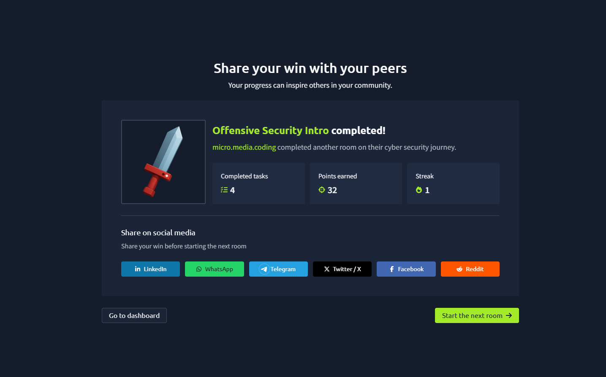
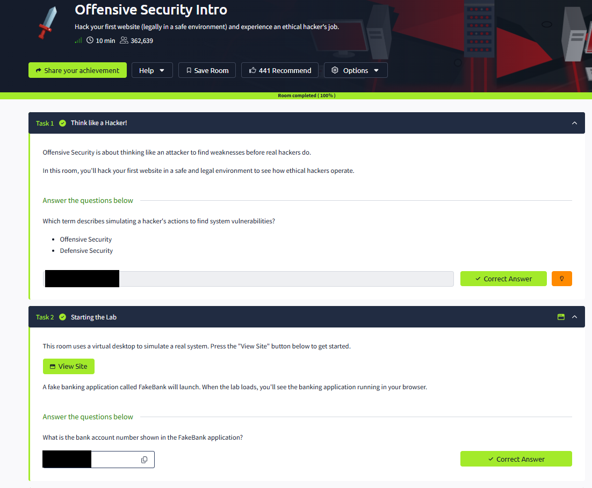
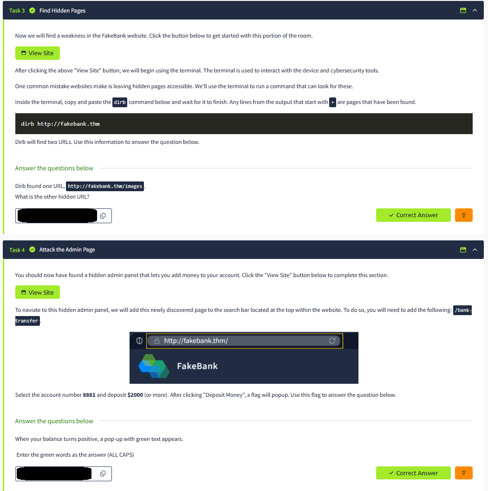

# Room 1- Offensive Security Introduction - TryHackMe

**Completed:** 23 March 2026  
**Difficulty:** Easy | **Time:** ~10–15 min  
**Room:** [Offensive Security Intro](https://tryhackme.com/room/offensivesecurityintro)

**Spoiler warning** — This write-up contains **zero answers**.

## Overview
This was my final room in the Pre-Security learning path and, honestly, one of the most enjoyable and eye-opening modules I have completed on TryHackMe.
“Become a Defender” gave me a clear, practical introduction to defensive (Blue Team) security, showing how defenders focus on prevention, detection, mitigation, analysis, and continuous improvement while always thinking like an attacker.
Using the city analogy made everything click — I now better understand visibility, layered defenses, and how every part of an organization’s ecosystem (devices, servers, firewall, mail, etc.) must be protected.
The hands-on mapping and tool-placement tasks in the VM were simple yet surprisingly insightful, reinforcing the defender mindset of threat anticipation, risk prioritization, and constant adaptation.
As the last room of the entire path, it perfectly capped everything I learned: I gained massive knowledge, sharpened my skills, and — most importantly — truly enjoyed the journey.
Combined with my recent Coursera specialization “Cyber Security in the AI Era,” I finally see the broader picture as a beginner and feel excited to keep exploring the “hidden parts of the map.”
This pathway was easily one of the best investments I’ve ever made. ⛳🚀

**Proof of Completion**  

## Screenshots (redacted - no answers visible)

## Walkthrough (no spoilers)
- Launched the FakeBank application in the browser.
- Used the terminal to run `dirb` and discovered hidden pages.
- Navigated to the newly found admin panel.
- Performed an action that triggered the success flag.

## What I Learned
- Offensive security = thinking like an attacker to find weaknesses first.
- Hidden pages are a real vulnerability.
- Even simple apps can have dangerous business-logic flaws.
- Everything here is 100% legal in a TryHackMe lab.

## Tools Used
- `dirb` (directory brute-forcing)

## Next Steps
- Continue Pre-Security path
- Move to Defensive Security Intro

## My profiles
- TryHackMe: [micro.media.coding](https://tryhackme.com/p/micro.media.coding)
- GitHub: [micromediacoding](https://github.com/micromediacoding)

---

*Write-up style follows my repository philosophy.*
